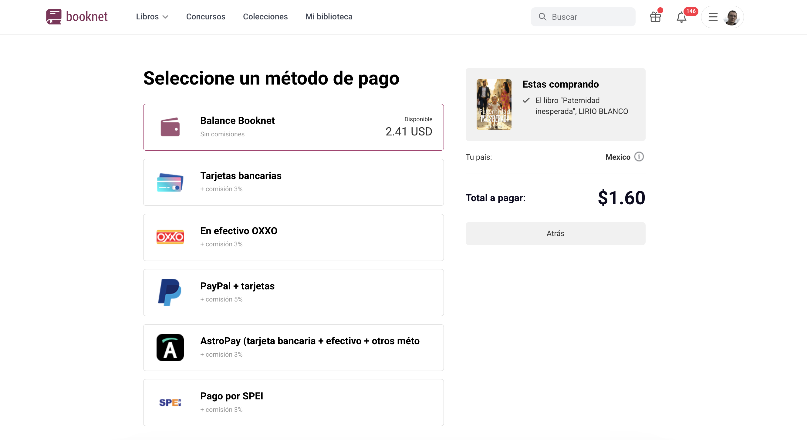

## Тестовое задание

"_Я встречал только несколько вещей менее логичных, чем так называемая **бизнес-логика**.
Мы вынуждены иметь дело со случайными наборами странных условий,
которые сочетаются между собой непредсказуемым образом. Определенно известно только одно:
Вся эта мешанина ещё и изменяется во времени._"
— Мартин Фаулер

Привет!

Данное задание направлено на выявление способности разобраться в запутанной предметной области,
упорядочить мешанину из бизнес требований и спроектировать код гибко и масштабируемо.
Ниже довольно много текста, но в основном это описание предметной области. Надеемся это не испугает вас.

---

Допустим у вас есть сайт, на котором продаются товары и есть разные способы оплаты.
У вас есть интеграция с разными платежными системами (например Interkassa, EasyPay, PayU, CardPay и 20 других)
и каждая платежная система может принимать платежи разными способами. Например:

- Interkassa
  - Банковские карты, комиссия 2.5%
  - LiqPay, комиссия 2%
  - Терминалы IBOX, комиссия 4%
- PayU
  - Локальные карты Индии, комиссия \_\_%
  - Карты VISA / MasterCard, комиссия 3%
  - QIWI-кошелек, комиссия \_\_%
- CardPay
  - Visa / MasterCard 1%
- и так далее...

Набор возможных способов оплат зависит от типа товара, страны покупателя, суммы заказа,
доступности платежных методов в данной стране и других критериев.

**Нужно написать функционал, который на вход будет получать набор параметров, а на выходе отдавать
массив доступных способов оплат для отображения пользователю. Например, как-то так:**

```php
// Входные параметры, которые откуда-то приходят, неважно откуда
$productType        = 'book';       // book | reward | walletRefill (пополнение внутреннего кошелька)
$amount             = 85.10;        // any float > 0
$lang               = 'en';         // only en | es | uk
$countryCode        = 'IN';         // any country code in ISO-3166 format
$userOs             = 'android';    // android | ios | windows

// Вам нужно сделать логику класса PaymentTypeSelector (можете назвать иначе, если хотите)
$paymentTypeSelector = new PaymentTypeSelector($productType, $amount, $lang, $countryCode, $userOs);
$paymentButtons = $paymentTypeSelector->getButtons();

// Где-то в шаблонах генерируется HTML для отображения кнопок.
// Там потребуются такие данные
foreach ($paymentButtons as $btn) {
    echo $btn->getName();
    echo $btn->getCommission();
    echo $btn->getImageUrl();
    echo $btn->getPayUrl();
}
```

Выглядит примерно так:


**Требования, кейсы, которые нужно учесть:**

- Определенные Платежные системы могут быть включены или выключены
- Определенные Способы оплаты могут быть включены или выключены на сайте
- У способа оплаты могут быть настройки доступности по странам.
  - Он может быть доступен ТОЛЬКО в указанных странах
  - Он может быть доступен везде КРОМЕ указанных стран
  - Может не быть никаких настроек по странам
- У способов оплат есть определенный приоритет. Чтоб например оплата картами шла на первом месте,
  с помощью терминалов на последнем.
- Если оплата происходит в испанской версии и сумма меньше $0.3, то способ оплаты через PayPal недоступен
- Если товар - Награда, испанской версия и сумма меньше $0.3, то оплатить можно только
  с помощью внутреннего кошелька на сайте. Никакие "внешние" способы оплат недоступны
- Оплата GooglePay доступна только с устройств на android, но недоступна в Индии ("IN")
- Оплата ApplePay доступна только с iOS устройств
- В Украине нужно показать две кнопки, ведущие на один и тот же способ оплаты с одной и той же комиссией, но
  у этих кнопок должны быть разные картинки и названия ("Оплата картой" и "Оплата картой ПриватБанка"), потому что
  Приват настолько большой, что люди воспринимают его как что-то отдельное. Если написать "Оплата банковскими картами"
  они спрашивают в саппорте "А картой Приватбанка можно?". Для них есть такая же точно кнопка, с подписью
  "Оплата картой Приватбанка"
- Если тип товара "Пополнение кошелька", то оплата с внутреннего кошелька недоступна

**Опционально, если хотите сделать больше:**

- Можно написать тесты
- Реализовать или описать словами возможную реализацию более сложных кейсов

**Более сложные кейсы, по желанию:**

- В платежной системе EBANX для метода оплаты Банковская карта ставить картинку в зависимости от страны пользователя.
  Например, если пользователь из Колумбии, то картинка "ebanx_card_co.jpg", если из Мексики, то "ebanx_card_mx.jpg".
  Оплата банковской картой через EBANX доступна в странах: MX, PE, CL, EQ, VE, CO, BR, AG.
- Если клиент передал параметр (в аргумент или с помощью метода
  сеттера типа `$paymentTypeSelector->enableYoomoneyDirectPayments()`), что для данного товара доступен метод оплаты
  через систему Yoomoney, то исключить способы оплаты картой через Connectum и CardPay, если они были доступны.
- Сделать возможность настройки порядка следования (приоритета) кнопок оплаты в зависимости от страны (уровень "Миссия невыполнима")

**Примечания по выполнению задания:**

- Не нужно делать никакого интерфейса, админок, управления настройками, вывода карточек - ничего.
  Это может быть консольный скрипт, который запускается с аргументами и печатает массив доступных кнопок оплат.
  Или это может быть веб-приложение, где в GET-параметры передаются параметры и печатается var_dump()
  или как угодно иначе выходной массив. Например:

```
GET http://localhost/index.php?productType=book&amount=45.67&lang=ru&countryCode=UA&userOs=android

Response:
[
    [
        'name' => 'Кошелек Booknet',
        'comission' => 0
        'imageUrl' => 'booknet_wallet.jpg',
        'payUrl' => '/pay/wallet'
    ],
    [
        'name' => 'Карты Visa / MasterCard',
        'comission' => 2.5
        'imageUrl' => 'connectum_cards.jpg',
        'payUrl' => '/pay/123'
    ],
    [
        'name' => 'Карты Приватбанк',
        'comission' => 2.5
        'imageUrl' => 'connectum_cards.jpg',
        'payUrl' => '/pay/123'
    ],
    [
        'name' => 'Терминалы IBOX',
        'comission' => 5
        'imageUrl' => 'wayforpay_terminal.jpg',
        'payUrl' => '/pay/456'
    ],
    ...
]
```

- Везде, где в требованиях идет речь о каких-то настройках, например, что какой-то способ оплаты может
  быть доступен только в определенных странах или наоборот везде кроме определенных стран, имеется ввиду, что у них
  есть такие настройки (поля в базе или еще где-то), но не нужно делать функционал управления этими настройками.
  Просто руками задайте пару настроек и все.
- Если у платежной системы "Х" есть способ оплаты "Банковская карта"
  и у платежной системы "Y" тоже есть оплата картой - это два разных способа оплаты.
  У них может быть разная комиссия, условия отображения и т.п.
- В требованиях упоминаются разных платежные системы и что будто у платежной системы EBANX есть способ оплаты картой, доступный для Мексики.
  Вам не нужно обращать внимания на конкретные названия платежек и способов оплат, которые упоминаются.
  Просто если писать Платежка Х, имеет способы оплаты A, B и С это будет сложнее для понимания и чаще всего в реальной работе никто так не будет формулировать.
- Нужно реализовать всего один класс PaymentTypeSelector и пару дополнительных
  для платежных систем и способов оплаты. Возможно подключить какую-то любимую ORM через composer.
  Использовать фреймворк будет лишним, но если вдруг вам так сподручнее - пожалуйста, это не проблема.
- Если задание отнимает больше времени, чем вы рассчитывали, позволяется пренебречь частью требований
  при условии, что вы явно укажите какие требования вы проигнорировали и сможете обсудить их реализацию устно.

---

#### &nbsp;

### Описание входных параметров

**ProductType**

- book (покупка книги)
- reward (покупка платной награды)
- walletRefill (пополнение внутреннего кошелька на сайте)

**Amount** - сумма к оплате, например "85.50"

**Lang** - языковая версия сайта, где покупатель покупает товар. В разных языковых версиях разные способы оплат.
Может быть одним из 3 значений:

- en
- es
- uk (Украина, не Великобритания)

**CountryCode** - Код страны, где находится покупатель, определенный по IP

- Например: UA (Украина), KZ, PL, US, DE, FR, IT etc...

**UserOs** - Операционная система пользователя. Возможные значения:

- windows
- android
- ios

#### &nbsp;

### Информация о предметной области

Как уже говорилось выше, есть Платежные системы, у которых есть разные поддерживаемые Способы оплат.
У каждого способа оплаты своя комиссия и условия, при которых его можно применять. Например, есть платежная система BilderlingsPay, которая имеет Способ оплаты "Банковская карта", который в свою очередь умеет работать с карточками Visa, MasterCard, American Express, но не умеет обрабатывать локальные карты в Индии. Так же есть платежная система DLocal, которая имеет разные Способы оплаты и в том числе Способ оплаты "Банковская карта", который умеет обрабатывать Visa, MasterCard, American Express, а так же и локальные карточки Индии. Но если у BilderlingsPay комиссия 2%, то у DLocal - 6%. Нам выгодно, чтоб максимальное кол-во оплат проходило через BilderlingsPay с комиссией 2% и только локальные карточки Индии проходили через DLocal. Поэтому в интерфейсе у покупателя должны быть отдельные две Кнопки "Карты Visa / MasterCard" и "Банковские карты Индии". При этом в условной админке в справочнике способов оплаты админ должен видеть "Банковские карты Индии" и должен понимать, что это просто название такое, на самом деле она и Visa и MasterCard тоже прекрасно процессит, просто у нее высокая комиссия и нам не надо, чтоб туда ходили все юзеры.

**Текст выше не является заданием, которое необходимо выполнять.
Здесь просто описано как это работает для понимания.**

##### Платежная система

- ID
- Название
- Описание/Комментарий для внутреннего пользования.
- ... возможно что-то еще?

##### Способ оплаты

- ID
- ID платежной системы
- Название
- Размер комиссии
- ... возможно что-то еще?

Для отображения способов оплаты в пользовательском интерфейсе, нужно иметь следующие данные:

- URL-картинки
- URL ссылки на оплату этим способом
- Название способа оплаты для пользователя
- Размер комиссии

[https://prnt.sc/wot5hi]: https://prnt.sc/wot5hi
